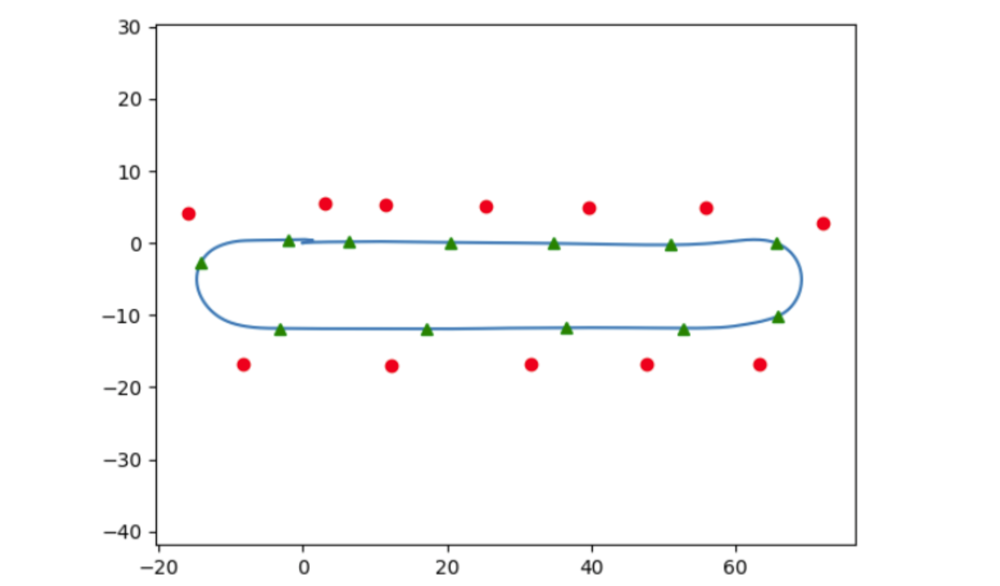

# Autonomous Vehicle Systems Engineering

The purpose of this repository is to demonstrate our deployment of different
tasks on a physical vehicle provided by AutonomousStuff. This work was done for the 
course CS 588 taught by Dr. Forsyth at the University of Illinois at Urbana-Champaign.

The contributers to this project are as follows:
* Priyam Mazumdar
* Hung Le
* Li-Kai Chuang
* Na-Teng Hung
* Nikash Walia
               

### Homework 1: PID for Control
Given a series of waypoints we had to transform from global coordinates to the car’s 
local frame, and then use the goal angle as feedback to PID control. After 
that, we used the GEM simulator to demonstrate our result.
                                                            
**Video of PID Control:** [GEM PID Control Video](https://www.youtube.com/watch?v=LxAkkcM0kqA&feature=youtu.be)

### Exercise 1: Flashing Distress
In this exercise, we learned to utilize the ROS publisher and subscriber to publish to the 
flashing signal light topic and learned to use the command to change the signal light on 
and off. We then write an iterative loop such that the signal light turns on and off at 
an SOS pattern (three left, three right).

**Video of Distress Signal:** [Distress Signal Video](https://www.youtube.com/watch?v=d7QPQu2PkQ8)

### Exercise 2: Pedestrian Detection Braking
For braking at the pedestrian, we utilized the Zed camera for depth perception and 
estimate the location of the pedestrian using YOLO detection. While the vehicle follows
a straight line at a constant speed with the PID controller, we command the vehicle to 
be 0 (stopping) when a certain distance is reached at the location of the pedestrian. Once the
pedestrian is out of view, the vehicle will then continue until again detecting another 
pedestrian.

**Video of Pedestrian Detection:** [Pedestrian Detection](https://www.youtube.com/watch?v=85XQcK6jR6M)

### Exercise 3: SLAM
For SLAM, we were given a Rosbag which contains the GEM vehicle data running around the 
parking lot. We simply followed the [repo](https://github.com/rsasaki0109/lidarslam_ros2)
by **rsasaki0109** to reconstruct the mapping using LIDAR-based slam in ROS2.

Video of SLAM: [SLAM](https://www.youtube.com/watch?v=L7aIJQ-XkXU)

### Exercise 4: Scribbling with GPS
In this exercise, we were given some waypoint examples and a pure pursuit controller 
that was tuned. We first create a figure-8 path using the GPS coordinates in 
(Lattitude, Longitude, and Azimuth), which we then convert into local XY coordinates 
using the Alvinxy library, then we feed each waypoint to the pure pursuit controller. 
At the intersection of the crossing figure-8, we create a special case to just look at 
the waypoint in a narrow vision such that it will only follow straight ahead to cross the 
“x” part of the figure-8 and complete the remaining loop back to the original starting point.

Interior Video of Figure 8: [Interior](https://www.youtube.com/watch?v=WjHBVMBZjFY)  \
Exterior Video of Figure 8: [Exterior](https://www.youtube.com/watch?v=fjSpPE78MSc)

### Final Project: Dynamic Cone Follower

For the final project, we performed a waypoint follow determined by traffic cones, 
where each observed traffic cone prompts the car to avoid it and swerve around to the 
next observed traffic cone.
                                             
Interior Video of Final Project: [Interior](https://www.youtube.com/watch?v=KW-ri2KDZ1E&feature=youtu.be)  \
Exterior Video of Final Project: [Exterior](https://www.youtube.com/watch?v=nAlBvvZJZE4)

The image below is a testing example of where might the observed cones (red) relative to 
the vehicle position (green triangle) in a predetermined path (blue lines). For the real 
test, the car is not given any path and solely relies on the visibility of the cones, 
which was done using a Blob and Coloring filter on the orange cones and coupled with 
depth sensing (Zed camera) to determine the relative position of the current cone to the car.

